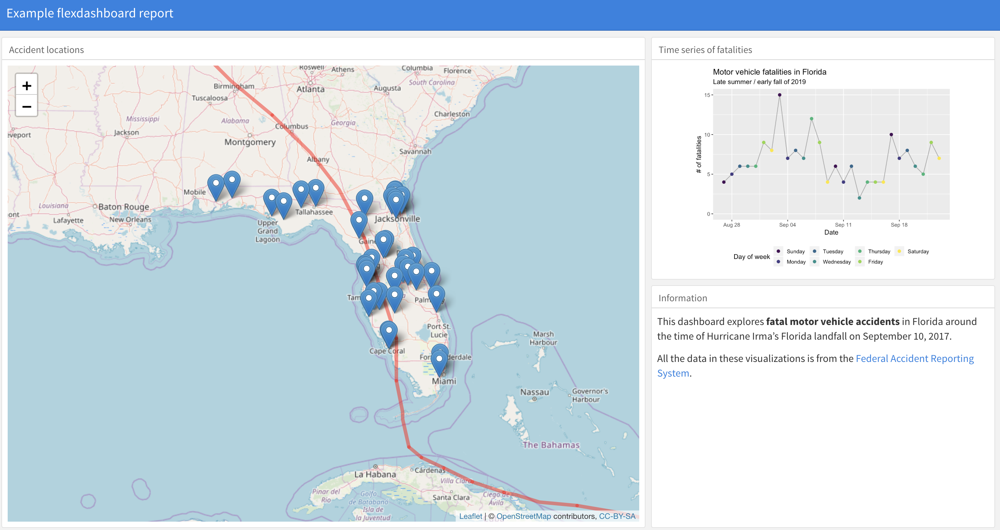

# Report

**Literate programming**, an idea developed by Donald Knuth, mixes code that can be executed with 
regular text. The files you create can then be rendered, to run any embedded code. The final output 
will have results from your code and the regular text. 

R has a collection of packages that extend these ideas of literate programming, allowing you to 
create reports that interweave R code, the results from that code, and text. This collection 
include the packages `knitr` and `rmarkdown`. I believe both are automatically installed to your
computer when you install RStudio.

This section will walk you through some of the basics of creating two types of reports using
RMarkdown: a basic RMarkdown report and a dashboard. The R project directory you downloaded in 
the "Prerequisites" section includes example files for both in its "reports" subdirectory. 

## RMarkdown

The RMarkdown framework makes it very easy to create nice reports from R code in RStudio.

Here are the basics of opening and rendering an R Markdown file in RStudio:

- To open a new R Markdown file, go to "File" -> "New File" -> "RMarkdown...". In the 
box that pops up, chose a "Document" in "HTML" format.
- This will open a new R Markdown file in RStudio. The file extension for R Markdown files is ".Rmd". 
- The new file comes with some example code and text. You can run the file as-is to try out the example.
You will ultimately delete this example code and text and replace it with your own.
- Once you "knit" the R Markdown file, R will render an HTML file with the output. This is automatically
saved in the same directory where you saved your .Rmd file.
- Write everything besides R code using Markdown syntax (explained below).

To include R code in an RMarkdown document, you need to separate off the code chunk using the 
following syntax (here, the code assigns the numbers one to 10 to the object `my_vec`):

    `r ''````{r}
    my_vec <- 1:10
    ```
    
This syntax might look unusual, but it tells R how to find the start and end of pieces of R code 
when the file is processed by R. R will walk through, find each piece of R code inside these 
special sections, run it and create
output (printed output or figures, for example). R will ignore anything not in one of these 
sections, including the text of the report. 
The output from this R processing will then pass into another program to complete 
rendering (e.g., a LaTeX engine for pdf files).

R Markdown files are mostly written using Markdown. To write R Markdown files, you need to understand 
what markup languages like Markdown are and how they work. 

In Word and other word processing programs you have used, you can add formatting using buttons and
keyboard shortcuts (e.g., "Ctrl-B" for bold). The file saves the words you type. It also saves the
formatting, but you see the final output, rather than the formatting markup, when you edit the file
(WYSIWYG -- what you see is what you get). 

In markup languages,^[Examples include HTML, LaTeX, and Markdown] on the other hand, you markup the
document directly to show what formatting the 
final version should have (e.g., you type `**bold**` in the file to end up with a document with 
**bold**).

To write a file in Markdown, you'll need to learn the conventions for creating formatting. This table
shows the markup for some common formatting choices:

```{r echo = FALSE}
markdown_format <- data.frame(Code = c("`**text**`",
                                       "`*text*`",
                                       "`[text](www.google.com)`", 
                                       "`# text`", 
                                       "`## text`"),
                              Rendering = c("**text**",
                                            "*text*",
                                            "[text](www.google.com)",
                                            "",
                                            ""),
                              Explanation = c("boldface",
                                              "italicized",
                                              "hyperlink",
                                              "first-level header",
                                              "second-level header"))
knitr::kable(markdown_format)
```

Some other simple things you can do in Markdown include:

- Lists (ordered or bulleted)
- Equations
- Tables
- Figures from file
- Block quotes
- Superscripts

See the resources listed in "Learn More" for links to some helpful resources for learning
RMarkdown, including more of these Markdown formatting mark-ups.

## Dashboards

In RStudio, you can also now create a "dashboard" using RMarkdown. A dashboard might be 
a good choice if you need to summarize or show a lot of information on a single webpage
in a way that everything can be viewed in one window. Figure \@ref(fig:dashboardexample)
gives an example dashboard (although this is just a screenshot---if posted online, the
leaflet map in this 
would be interactive).

```{r dashboardexample, echo = FALSE, full.figwidth = TRUE, fig.cap = "Example of a dashboard created with RMarkdown."}

```

To create a dashboard, you'll need to have the `flexdashboard` package [@R-flexdashboard]
installed. If you have this package installed, you can create a dashboard by opening your
RStudio session and selecting "File" -> "New File" -> "RMarkdown". In the box that pops 
up, go to the "From Template" tab and select "Flexdashboard". 

The R Project with examples for this workshop includes an example file for creating 
a dashboard in the "reports" subdirectory's "flexdashboard_example.Rmd" file.^[You might
notice that there are some other files in this subdirectory that start with "flexdashboard_example".
These are the files that are written out when you knit the RMarkdown file. You should never
change these by hand, but these include the files you'll want to share or post online as
the output of the RMarkdown file (e.g., "flexdashboard_example.html").]
Open this 
file and try creating the dashboard using the "Knit" button. You can get an idea for how
the code converts to elements of the dashboard by changing some of the code in the 
RMarkdown file. 

The `flexdashboard` package is extensively documented through [its website](https://rmarkdown.rstudio.com/flexdashboard/), where you can find many examples of
how to create dashboards with RMarkdown.

## Learn more

For more Markdown conventions, see [RStudio's R Markdown Reference Guide](https://www.rstudio.com/wp-content/uploads/2015/03/rmarkdown-reference.pdf) (link also available through "Help" in RStudio). There are several great books on `knitr` and RMarkdown now;
[R Markdown: The Definitive Guide](https://bookdown.org/yihui/rmarkdown/) is particularly 
good, and includes the creater of `knitr` and `rmarkdown` as a coauthor. 

For more on creating dashboards using RMarkdown, see [`flexdashboard` package's website](https://rmarkdown.rstudio.com/flexdashboard/), which includes many examples
of code and output for these dashboards. 

You can post the output of an RMarkdown file for free (note that it will be public) through 
[RPubs](http://www.rpubs.com/). This is also a great site for exploring reports others have 
created using RMarkdown. 
For more on posting your own files to RPubs, [see here](http://www.rpubs.com/about/getting-started).

A collection of books published with R using RMarkdown is available through
[bookdown.org](https://bookdown.org/). You can also use RMarkdown to create your own website 
with a blog using the `blogdown` package, which is explained in 
[blogdown: Creating Websites with R Markdown](https://bookdown.org/yihui/blogdown/).

