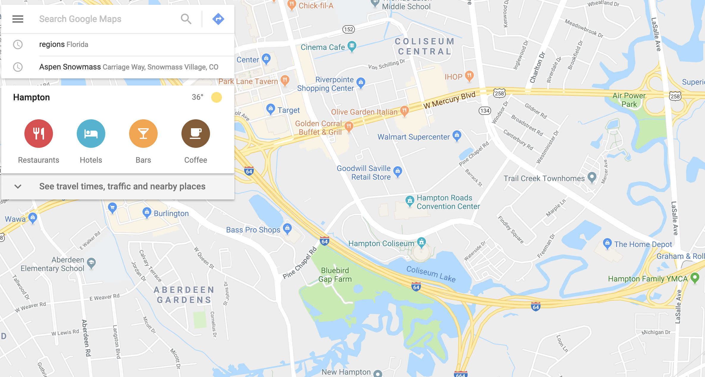

```{r echo = FALSE}
knitr::opts_knit$set(root.dir = "..")
```


## Today's goals

- LEARN principles of a key R plotting framework \bigskip
- UNDERSTAND what R can do for visualizations \bigskip
- KNOW what to do next to learn more

## Homework?!

\begin{center}
\url{goo.gl/7fPYUx}
\end{center}

## Today's plan

\montserratfont
- \largetext{PLOT} \bigskip
- \largetext{MAP} \bigskip
- \largetext{INTERACT} \bigskip
- \largetext{REPORT} \bigskip
- \largetext{TIDY} 

____

\begin{center}
 \hugetext{PREREQUISITES} 
 \medskip 
 \small Setting up for success
\end{center}

## R packages

```{r echo = FALSE, fig.align = "center", out.width = "0.7\\textwidth"}
knitr::include_graphics("images/BrioBasicSet.jpg")
```

## R packages

```{r echo = FALSE, fig.align = "center", out.width = "\\textwidth"}
knitr::include_graphics("images/BrioFancySet.jpg")
```

## Installing R packages

```{r eval = FALSE}
install.packages("readr")
```

\bigskip

\small Use the \textbf{install.packages} function to install an R package to your computer.

## Loading R packages

```{r}
library("readr")
```

\bigskip

\small Use the \textbf{library} function to load an R package that is installed on your computer.

____

\tikz[overlay,remember picture] \node[opacity=0.8, at=(current page.center)]{%
  \includegraphics[width=0.85\paperwidth]{images/nametag}};

\begin{center}
 \vspace{1in}
 \hugetext{\inconsolatafont <-} 
 \medskip 
 \small Assign an object a name with R's \textbf{gets arrow}
\end{center}

## Assignment with the gets arrow

You want to read in the "daily_fatalities.csv" file, which is in the "data" subdirectory.

## Assignment with the gets arrow

\small

Assign the filepath of this file to the R object named **fatalities_files**. 

\medskip

Reference that object to read in the data and assign it to the R object 
named **daily_fatalities**.

```{r message = FALSE}
fatalities_file <- "data/daily_fatalities.csv"
daily_fatalities <- read_csv(fatalities_file)
```

## Hurricane Irma

\begin{center}
\includegraphics[width = \textwidth]{images/irma_track}
\end{center}

## Hurricane Irma

\begin{center}
\includegraphics[width = \textwidth]{images/nsw_irma_warning}
\end{center}

## Hurricane Irma

\begin{center}
\includegraphics[width = \textwidth]{images/irma_evac}
\end{center}

____

\begin{center}
\includegraphics[width = \textwidth]{images/fars}
\end{center}

\url{https://www.nhtsa.gov/research-data/fatality-analysis-reporting-system-fars}

## Example data

\small

```{r}
daily_fatalities
```


____

\begin{center}
 \hugetext{PLOT} 
 \medskip 
 \small R's \textbf{ggplot2} framework for plotting
\end{center}

## `ggplot2`: Think layers

```{r echo = FALSE}
knitr::include_graphics("images/smith_island_cake")
```

## Plot elements

\small

\begin{itemize}
\item {\color{colorblue}\textbf{data}} Observations shown with the plot
\item {\color{colorblue}\textbf{geoms}} Geometric objects showing the data on the plot, with aesthetics
mapped to characteristics of the data or given constant values.
\item {\color{colorblue}\textbf{coordinate system}} Grid system defining how the data in the plot
are layed out; often a Cartesian coordinate system
\item {\color{colorblue}\textbf{scales}} Rules defining how aesthetics from the data are mapped
to characteristics of the geoms
\item {\color{colorblue}\textbf{labels}} Names of axes and other scales, as well as plot titles
\item {\color{colorblue}\textbf{themes}} Background elements of the plot
\end{itemize}

## Spot the differences

```{r echo = FALSE, message = FALSE}
library(magrittr)
library(readr)
library(ggplot2)
library(forcats)
library(dplyr)
library(gridExtra)
library(cowplot)

daily_fatalities <- read_csv("data/daily_fatalities.csv")

daily_fatalities %<>% 
  mutate(weekday = fct_relevel(weekday,
                               "Sunday", "Monday", "Tuesday", 
                               "Wednesday", "Thursday", "Friday", "Saturday"))

a <- ggplot(data = daily_fatalities) + 
  geom_line(aes(x = date, y = fatals),
            color = "darkgray") + 
  geom_point(aes(x = date, y = fatals, color = weekday),
             size = 2)

b <- ggplot(data = daily_fatalities) + 
  geom_line(aes(x = date, y = fatals),
            color = "darkgray") + 
  geom_point(aes(x = date, y = fatals, color = weekday),
             size = 2) + 
  scale_color_viridis_d() + 
  expand_limits(y = 0) +
  labs(x = "Date", y = "# of fatalities", color = "Day of week") + 
  theme(legend.position = "bottom") + 
  ggtitle("Motor vehicle fatalities in Florida",
          subtitle = "Late summer / early fall of 2019")

plot_grid(
  a, NULL, b,
  ncol = 1,
  rel_heights = c(1, 0.05, 1),
  labels = c("A", "", "B")
)
```


____

\tikz[overlay,remember picture] \node[opacity=0.2, at=(current page.center)]{%
  \includegraphics[width=1\paperwidth]{images/example_code}};
\color{colorblue}
\begin{center}
\hugetext{\montserratfont [Live coding example]}
\end{center}

## "Kirk Moment"

```{r echo = FALSE, out.height = "0.8\\textheight", fig.align = "center"}
knitr::include_graphics("images/raincomparison.pdf")
```

____

\begin{center}
 \hugetext{MAP} 
 \medskip 
 \small R's \textbf{sf} framework for mapping
\end{center}

____

\huge
\center

sf: simple features

## `sf` class

\footnotesize

```{r echo = FALSE, message = FALSE}
library("readr")
library("sf")
library("magrittr")

fl_accidents <- read_csv("data/fl_accidents.csv")

fl_accidents %<>% 
  st_as_sf(coords = c("longitud", "latitude")) %>% 
  st_sf(crs = 4326)

fl_accidents
```


## Open Data APIs

```{r eval = FALSE}
library(tigris)
fl_counties <- counties(state = "FL",
                        class = "sf")
```
```{r echo = FALSE}
load("data/fl_counties.RData")
```

```{r echo = FALSE, out.height = "0.5\\textheight", fig.align = "center", fig.width = 4}
ggplot() + 
  geom_sf(data = fl_counties, 
          aes(fill = ALAND)) + 
  theme_bw() + 
  scale_fill_viridis_c(name = "Land area", label = scales::scientific) + 
  theme(axis.text = element_blank(),
        axis.ticks = element_blank())
```

____

\tikz[overlay,remember picture] \node[opacity=0.2, at=(current page.center)]{%
  \includegraphics[width=1\paperwidth]{images/example_code}};
\color{colorblue}
\begin{center}
\hugetext{\montserratfont [Live coding example]}
\end{center}

## "Kirk Moment"

```{r echo = FALSE, fig.align = "center", out.height = "0.4\\textheight"}
knitr::include_graphics("images/ok_headline")
```

```{r echo = FALSE, fig.align = "center", out.height = "0.4\\textheight"}
knitr::include_graphics("images/ok_case")
```

____

\begin{center}
 \hugetext{INTERACT} 
 \medskip 
 \small R's \textbf{htmlwidgets} framework for interacting
\end{center}

## Interactive graphics

```{r echo = FALSE, out.width = "\\textwidth", fig.align = "center"}

```

## JavaScript

```{r echo = FALSE, out.height = "0.8\\textheight", fig.align = "center"}
knitr::include_graphics("images/javascript")
```

____

\center

\huge htmlwidgets

\small
\url{https://www.htmlwidgets.org/}

## `leaflet` map

```{r echo = FALSE, out.height = "0.8\\textheight", fig.align = "center"}
knitr::include_graphics("images/leaflet_example")
```

____

\tikz[overlay,remember picture] \node[opacity=0.2, at=(current page.center)]{%
  \includegraphics[width=1\paperwidth]{images/example_code}};
\color{colorblue}
\begin{center}
\hugetext{\montserratfont [Live coding example]}
\end{center}

## "Kirk Moment"

```{r echo = FALSE, out.height = "0.7\\textheight", fig.align = "center"}
knitr::include_graphics("images/maze-minecraft.png")
```

\center
\url{https://github.com/ropenscilabs/miner}

____

\begin{center}
 \hugetext{REPORT} 
 \medskip 
 \small R's \textbf{RMarkdown} framework for reporting
\end{center}

## Donald Knuth

\tikz[overlay,remember picture] \node[opacity=0.8, at=(current page.center)]{%
  \includegraphics[width=0.85\paperwidth]{images/knuth_bi}};
\color{white}
\vspace{-0.9in}
\epigraph{If you think you're a really good programmer... read Art of Computer Programming... 
You should definitely send me a résumé if you can read the whole thing.''}
{\textit{Bill Gates} }

## Yihui Xie

\tikz[overlay,remember picture] \node[opacity=0.8, at=(current page.center)]{%
  \includegraphics[width=0.9\paperwidth]{images/yihui}};
  
____

\begin{center}
 \hugetext{WYSISYG} 
 \medskip 
 \small \textbf{W}hat \textbf{Y}ou \textbf{S}ee \textbf{I}s \textbf{W}hat \textbf{Y}ou \textbf{G}et
\end{center}

____

\small

````markdown
Text of the report, with Markdown **format markers**.

`r ''````{r}
number_one <- 1

number_one
```

More text, *also* with Markdown format markers. 
And a list: 

\- Item 1 

\- Item 2

````

____

\small

Text of the report, with Markdown **format markers**.

```{r}
number_one <- 1
number_one
```

More text, *also* with Markdown format markers. And some items: 

- Item 1
- Item 2

## Flexdashboard

```{r echo = FALSE, out.height = "\\textheight"}
knitr::include_graphics("images/flexdashboard_example")
```

____

\tikz[overlay,remember picture] \node[opacity=0.2, at=(current page.center)]{%
  \includegraphics[width=1\paperwidth]{images/example_code}};
\color{colorblue}
\begin{center}
\hugetext{\montserratfont [Live coding example]}
\end{center}

## "Kirk Moment"

```{r echo = FALSE}
knitr::include_graphics("images/workshop_booklet")
```


____

\begin{center}
 \hugetext{TIDY} 
 \medskip 
 \small R's \textbf{tidyverse} framework for tidying
\end{center}

## "Tidy" data

```{r echo = FALSE, fig.align = "center"}
knitr::include_graphics("images/tidy-1")
```

\footnotesize 
Source: [*R for Data Science*](https://r4ds.had.co.nz/), Grolemund and Wickham

## Untidy data example

\footnotesize

```{r echo = FALSE}
data(VADeaths)
knitr::kable(VADeaths)
```

____

\center
\small
Why are Legos such a great toy?

```{r echo = FALSE, fig.align = "center", out.width = "0.9\\textwidth"}
knitr::include_graphics("images/legos")
```

## Tidyverse: Small functions that play well together

\begin{itemize}
\item \textbf{select} some columns \medskip
\item \textbf{slice} to certain rows, or \textbf{filter} to rows that meet certain conditions \medskip
\item \textbf{mutate} existing columns to create new ones or change the old ones in place \medskip
\item \textbf{unite} separate columns into one \medskip
\item \textbf{summarize} the data, maybe after you \textbf{group\_by} certain characteristics
\end{itemize}

## Pipe operator

```{r echo = FALSE, fig.align = "center", out.height = "0.85\\textheight"}
knitr::include_graphics("images/magrittr")
```


## Cleaning data with the tidyverse

\footnotesize

```{r eval = FALSE}
fl_accidents %>% 
  rename_all(.funs = str_to_lower) %>% 
  select(state, county, day, month, year,
         latitude, longitud, fatals) %>% 
  filter(state == 12) %>% 
  mutate(county = str_pad(county, width = 3, pad = "0")) %>% 
  unite(col = fips, c(state, county), sep = "") %>% 
  unite(col = date, c(month, day, year), sep = "-") %>% 
  mutate(date = mdy(date)) %>% 
  filter(date >= mdy("9-7-2017") & date <= mdy("9-13-2017"))
```


____

\tikz[overlay,remember picture] \node[opacity=0.2, at=(current page.center)]{%
  \includegraphics[width=1\paperwidth]{images/example_code}};
\color{colorblue}
\begin{center}
\hugetext{\montserratfont [Live coding example]}
\end{center}


## "Kirk Moment"

\includegraphics[width = \textwidth]{images/CRAN_package_10000}

## Homework!!

\begin{center}
\url{goo.gl/7fPYUx}
\end{center}

